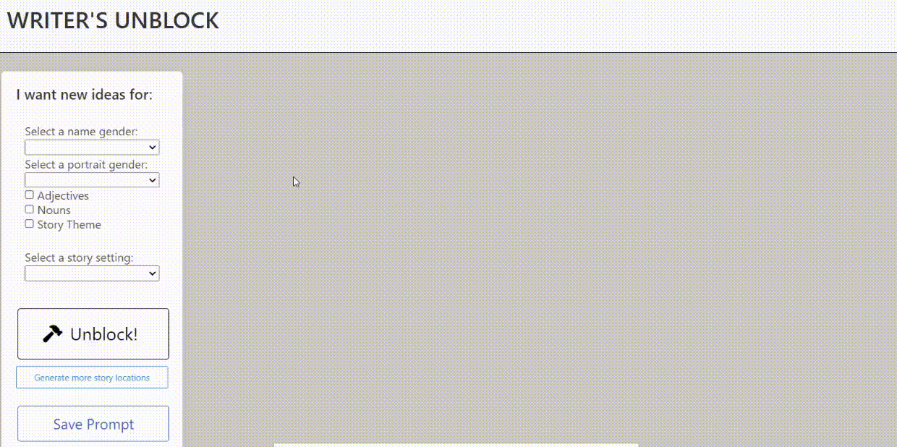
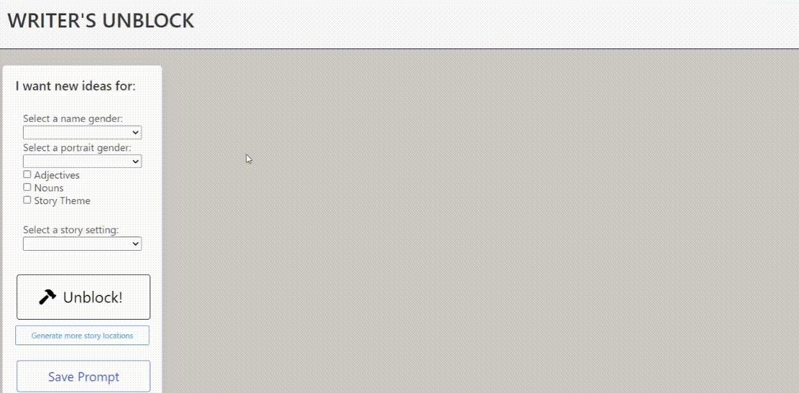
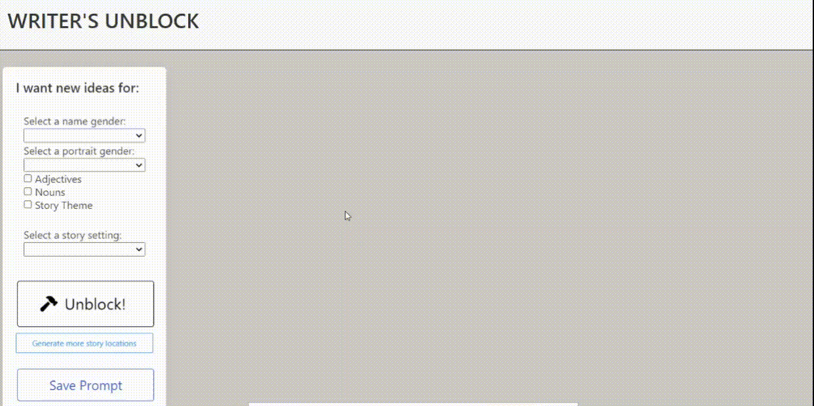

# Writer's Unblock

## Description

Writer's Unblock is an app intended to spur creativity. The app will deliver prompts based on the user's selections.

[Writer's Unblock](https://pdbesse.github.io/Writers-Unblock/)

## Table of Contents

* [Installation](#installation)
* [Usage](#usage)
* [Bulma](#bulma-css-framework)
* [User Stories and Code Snippets](#user-stories-and-code-snippets)
* [Technology](#technology)
* [Credits](#credits)

## Installation

The website has been installed and deployed on [Github](https://github.com/).

## Usage

The user is presented with a welcome screen consisting of a background image and an "Unblock!" button.  Upon clicking the button, the user is directed to the prompt selection page.  The user can select and number of prompt choices, including: a random name; a random portrait; random adjectives; random nouns; a random story theme; and random story location images. 

If the user selects no options, a warning message will appear, directing them to make at least one choice. When the user makes the prompt selections and clicks the "Unblock!" button, the randomly generated and retrieved responses will populate the HTML page.

If the user clicks the "Save Prompt" button, the responses will be saved to local storage.


## Bulma (CSS Framework)

Bulma is a simple to use css framework built around flexbox.  For Writer's Unblock, we utilized the classes Columns, Column, and Box.  Columns designate an area to be arranged as columns, within which you nest an element with the column class.  Within column we used Box as our main way of separating content.  The Bulma box class creates clean looking boxes with rounded edges and a little shadow. 

Bulma documentation - [Bulma](https://bulma.io/documentation/)

Because Bulma is built around flexbox, your application is already responsive to different screen sizes.  You can add in classes for different types such as mobile or tablet if you want to maintain an exact structure, but we found that for our application we did not need to specify.


## User Stories and Code Snippets

```javascript

$("#search-btn").click(function () {
    if (portraitCheck.val() !== "blank") {
        getPersonPicture();
    }
    if (adjCheck.is(":checked")) {
        getAdjs();
    }
})

```

This code block is a small sample of what happens on a click of the Unblock button (#search-btn). It shows two validation methods to run functions: the portraitCheck is done on a dropdown, so we only have getPersonPicture() run if the value of the selection does not equal "blank". The adjCheck is done with a checkbox, so we only have getAdjs() run if the box is checked.

### getName()
```
AS A writer
I WANT TO generate a random name
SO THAT I might be inspired in my writing
```


```javascript

function getName() {
    var nameGender = nameCheck.val();
    var nameURL = `https://randomuser.me/api/?gender=${nameGender}&nat=us`;
    fetch(nameURL).then(function (response) {
        return response.json();
    })
        .then(function (namedata) {
            var name = ((namedata.results[0].name.first) + " " + (namedata.results[0].name.last));

            $("#name").text(name);
            promptObjLS["name"] = name;
        })
}

```

This code block is used to fetch a random name from the randomuser.me API and add it to the HTML. It pulls the var nameGender from the input value and passes it to the request URL with a template literal. It then pulls the first and last name from the JSON response and adds it to the page and to the local storage object.

### getPersonPicture()
```
AS A writer
I WANT TO generate a random portrait
SO THAT I might be inspired in my writing
```


```javascript

function getPersonPicture() {
    var accessKey = "vNp_yDUN4379mM9W7GXhDe7zPCQf4EFeAtidDbMYbEE";
    var portraitGender = portraitCheck.val();
    var pageNum = Math.floor(Math.random() * 5);
    var personPicURL = `https://api.unsplash.com/search/photos?&query=${portraitGender}%20person&per_page=30&page=${pageNum}&client_id=${accessKey}`

    fetch(personPicURL).then(function (response) {
        return response.json();
    })
        .then(function (portraitdata) {
            i = Math.floor(Math.random() * portraitdata.results.length);
            var portraitLink = portraitdata.results[i].urls.small;
            portrait.attr("src", portraitLink);
            promptObjLS["portrait"] = portraitLink;
        })
}

```

This code block is used to getch a random portrait picture from the Unsplash API and add it to the HTML. Like the preceeding function, it pulls the var nameGender from the input value and passes it into the request URL. We had it return a random page because the images for a given set of search parameters are always returned in the same order. We then return a random image from the array of returned images, pull the URL, and add the URL to the image source in the HTML. The link is also added to the local storage object.

### getAdjs()
```
AS A writer
I WANT TO generate random adjectives
SO THAT I might be inspired in my writing
```


```javascript

function getAdjs() {
    const options = {
        method: 'GET',
        headers: {
            'X-RapidAPI-Key': '5310a4a30cmsh92d3fc3f3671101p143a11jsn790aeb586352',
            'X-RapidAPI-Host': 'wordsapiv1.p.rapidapi.com'
        }
    };
    for (i = 0; i < 3; i++) {
        fetch('https://wordsapiv1.p.rapidapi.com/words/?random=true&partOfSpeech=adjective', options)
            .then(function (response) {
                return response.json();
            })
            .then(function (adjdata) {
                var adjCard = document.createElement("div");
                adjCard.setAttribute("class", "card, column");
                $(adjCard).append("<h5 class='card-header'>" + adjdata.word + "</h5>");
                $(adjCard).append("<p class='card-content'>" + adjdata.results[0].definition + "</p>");
                $("#adj-container").append(adjCard);
            })
    }
}

```

This code block is the function to pull a random adjective from the Words API and add the word and definition to the HTML. We used headers for the request and response authorization. The fetch is run three times with a for loop because the "random=true" search parameter will only return one word at a time. The random adjective and defintion are pulled from the response before a div is created on the HTML. We hadd the div's class before setting the h5 and p content. Finally, the div is added to the HTML to the parent container for all of the returned words and definitions.

We had two separate functions for random nouns and random adjectives. This could have been accomplished with one function by using a dropdown for the input selection and passing the value through to the "partOfSpeeh=" paramter using template literals.

### getTheme()
```
AS A writer
I WANT TO generate a random story theme
SO THAT I might be inspired in my writing
```


```javascript

var storyThemes = ["Good vs Evil", "Love", "Redemption", "Courage & Perseverance", "Coming of Age", "Revenge"]

function getTheme() {
    var i = Math.floor(Math.random() * storyThemes.length);
    $("#story-theme").text(storyThemes[i]);
    promptObjLS["theme"] = storyThemes[i];
}

```

This code block shows the array we created to contain the 6 story themes in literature. The function pulls a random element from the array and adds the element to the HTML and to the local storage object.

```
user story
```
GIF

```javascript

code here

```

explanation

```
user story
```
GIF

```javascript

code here

```

explanation

## Technology

Technology Used:
* [GitHub](https://github.com/)
* [GitBash](https://gitforwindows.org/)
* [Visual Studio Code](https://code.visualstudio.com/)
* [Javascipt](https://www.javascript.com/)
* [jQuery](https://jquery.com/)
* [Bulma](https://bulma.io/)
* [HTML](https://developer.mozilla.org/en-US/docs/Web/HTML)
* [W3 CSS](https://www.w3.org/Style/CSS/Overview.en.html)
* [Unsplash API](https://unsplash.com/documentation)
* [Words API](https://www.wordsapi.com/docs/)
* [Randomuser.me](https://randomuser.me/documentation)
* [Masonry](https://masonry.desandro.com/)

## Credits

All coding credited to Zori Zulkhuu, Liam McCarthy, and Phillip Besse.

## License

Zori Zulkhuu, Liam McCarthy, and Phillip Besse's Writer's Unblock is licensed under the [MIT License](https://choosealicense.com/licenses/mit/).

MIT License

Copyright (c) 2022 Zori Zulkhuu, Liam McCarthy, and Phillip Besse

Permission is hereby granted, free of charge, to any person obtaining a copy
of this software and associated documentation files (the "Software"), to deal
in the Software without restriction, including without limitation the rights
to use, copy, modify, merge, publish, distribute, sublicense, and/or sell
copies of the Software, and to permit persons to whom the Software is
furnished to do so, subject to the following conditions:

The above copyright notice and this permission notice shall be included in all
copies or substantial portions of the Software.

THE SOFTWARE IS PROVIDED "AS IS", WITHOUT WARRANTY OF ANY KIND, EXPRESS OR
IMPLIED, INCLUDING BUT NOT LIMITED TO THE WARRANTIES OF MERCHANTABILITY,
FITNESS FOR A PARTICULAR PURPOSE AND NONINFRINGEMENT. IN NO EVENT SHALL THE
AUTHORS OR COPYRIGHT HOLDERS BE LIABLE FOR ANY CLAIM, DAMAGES OR OTHER
LIABILITY, WHETHER IN AN ACTION OF CONTRACT, TORT OR OTHERWISE, ARISING FROM,
OUT OF OR IN CONNECTION WITH THE SOFTWARE OR THE USE OR OTHER DEALINGS IN THE
SOFTWARE.
